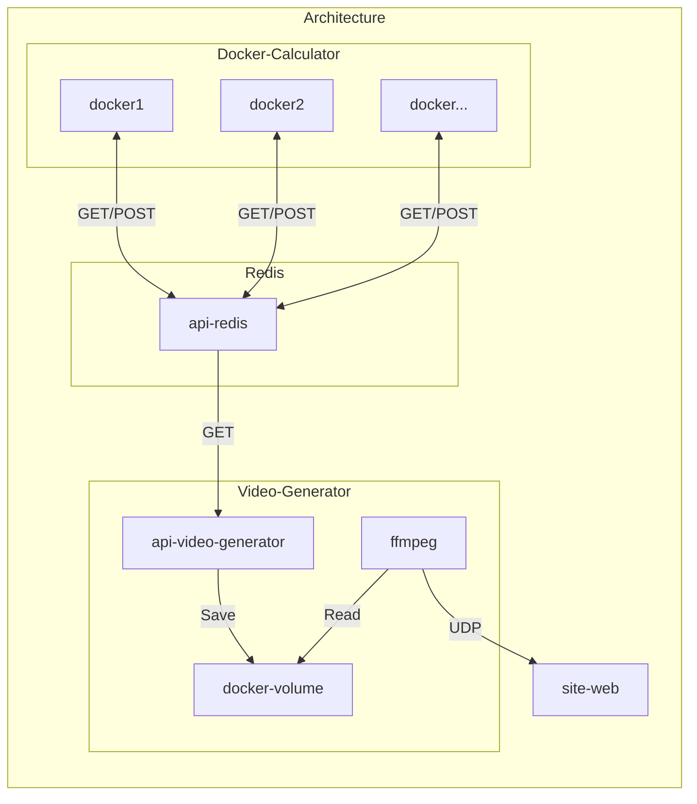

# nbody-simulator-docker

        
        
        
        
        

[//]: # (         )

## Description

This is a simple n-body simulator made with OpenGL for the graphics part and C++ for the logic part.
The project is running on a complete docker environment.

> **Note**  
> The project is a test of paralleling the calculation of the particles on different docker containers and store them in
> a redis database.
> A docker is also used to generate the video from the redis database.

## Images

## Videos

## Dependencies

- OpenGL version: 3.3
- GLSL version: 330
- GLFW version: 3.3.8
- Glad version: 0.1.36
- GLM version: 0.9.9
- OpenCV version: 4.7.0-dev
- nlhomann/json version: 3.9.1
- libcurl version: 7.74.0

## Architecture

## Libraries

docker:  
<https://www.docker.com/>

cmake:  
<https://cmake.org/>

glfw:  
<https://www.glfw.org/docs/latest/>

glm:  
<https://glm.g-truc.net/0.9.9/index.html>

glad:  
<https://glad.dav1d.de/>

OpenGL:  
<https://www.opengl.org/>

Json:  
<https://github.com/nlohmann/json>

libcurl:  
<https://curl.se/libcurl/>

## Contributors

Axel COURMONT:

- @Alshkor
- <https://github.com/Alshkor>

Alexis ROVILLE:

- @Fromiel
- <https://github.com/Fromiel>

Quentin MOREL:

- @Im-Rises
- <https://github.com/Im-Rises>

