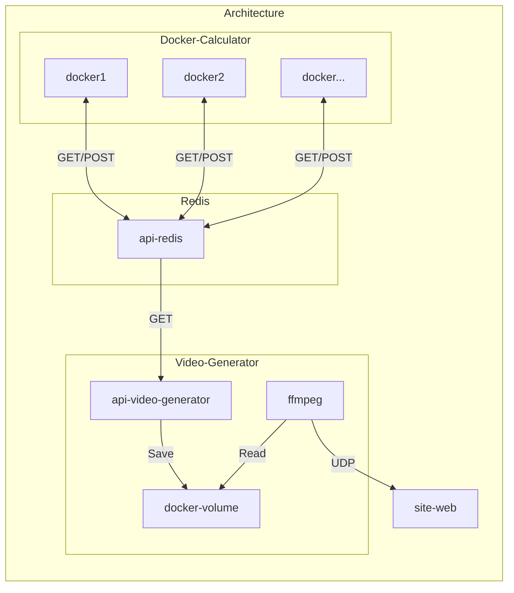

# nbody-simulator-cloud

<p align="center">
      
      
      
      
</p>

## Description

This is a simple nbody simulator made with OpenGL and C++ with the help of the ImGui library for the UI.

## Images

## Videos

## Features

## Dependencies

- OpenGL version: 3.3
- GLSL version: 330
- GLFW version: 3.3.8
- Glad version: 0.1.36
- GLM version: 0.9.9
- OpenCV version: 4.7.0-dev
- nlhomann/json version: 3.9.1

## Architecture

```bash
ffmpeg -f x11grab -i title="Nbody Simulator raphics" -vcodec libx264 -pix_fmt yuv420p -tune zerolatency -preset ultrafast -f mpegts http://127.0.0.1:8080
ffmpeg -f x11grab -y -r 30 -s 1920x1080 -i $DISPLAY -vcodec huffyuv out.avi
ffmpeg -f x11grab -video_size 1920x1080 -framerate 30 -i $DISPLAY -vcodec libx264 -preset ultrafast -tune zerolatency -f mpegts udp://localhost:1234
```



## Json data transfer

```json
{
  "particles": [
    {
      "index": 0,
      "position": [
        0,
        0,
        0
      ],
      "velocity": [
        0,
        0,
        0
      ]
    },
    {
      "index": 1,
      "position": [
        0,
        0,
        0
      ],
      "velocity": [
        0,
        0,
        0
      ]
    }
  ]
}
```

## Github-Actions

[](https://github.com/Im-Rises/NBodySimulator/actions/workflows/codeql.yml)
[](https://github.com/Im-Rises/NBodySimulator/actions/workflows/cmake.yml)
[](https://github.com/Im-Rises/NBodySimulator/actions/workflows/flawfinder.yml)
[](https://github.com/Im-Rises/NBodySimulator/actions/workflows/cpp-linter.yml)

The project is set with a set of different scripts:

- CodeQL: This script is used to check the code for security issues.
- CMake: This script is used to build the project.
- Flawfinder: This script is used to check the code for security issues.
- Cpp Linter: This script is used to check the code for security issues.

## Libraries

glfw:  
<https://www.glfw.org/docs/latest/>

glm:  
<https://glm.g-truc.net/0.9.9/index.html>

glad:  
<https://glad.dav1d.de/>

OpenGL:  
<https://www.opengl.org/>

Json:  
<https://github.com/nlohmann/json>

libcurl:  
<https://curl.se/libcurl/>

## Contributors

Axel COURMONT:

- @Alshkor
- <https://github.com/Alshkor>

Alexis ROVILLE:

- @Fromiel
- <https://github.com/Fromiel>

Quentin MOREL:

- @Im-Rises
- <https://github.com/Im-Rises>

[](https://github.com/Im-Rises/NBodySimulator/graphs/contributors)
