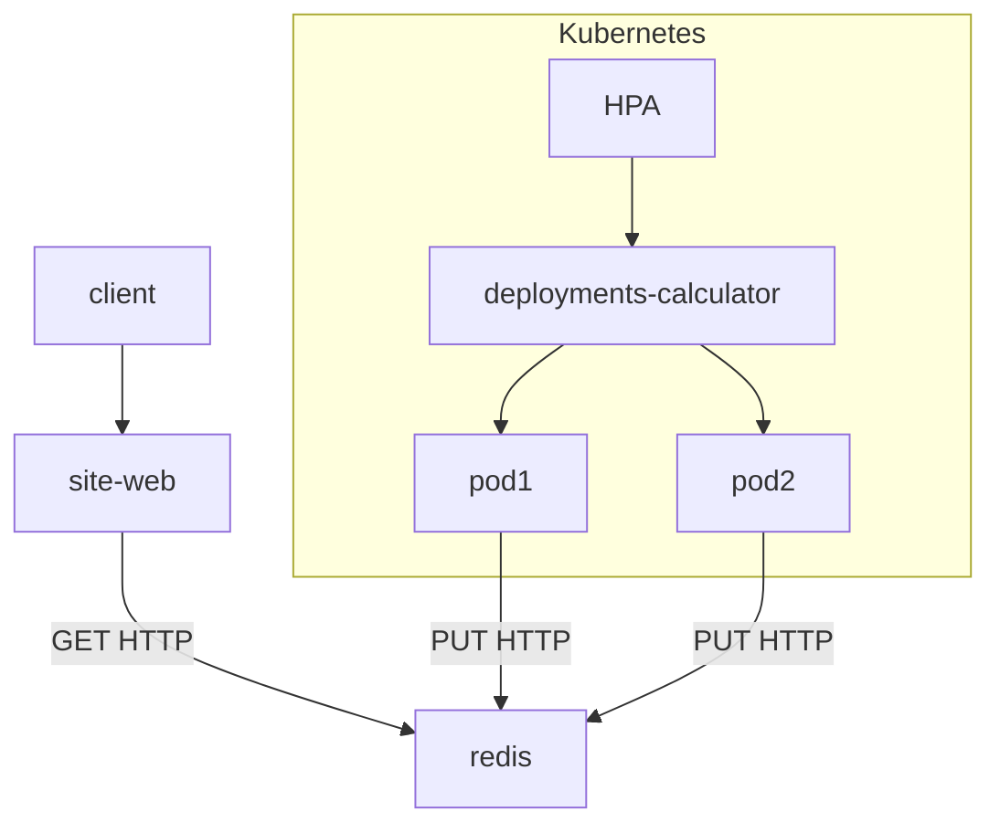
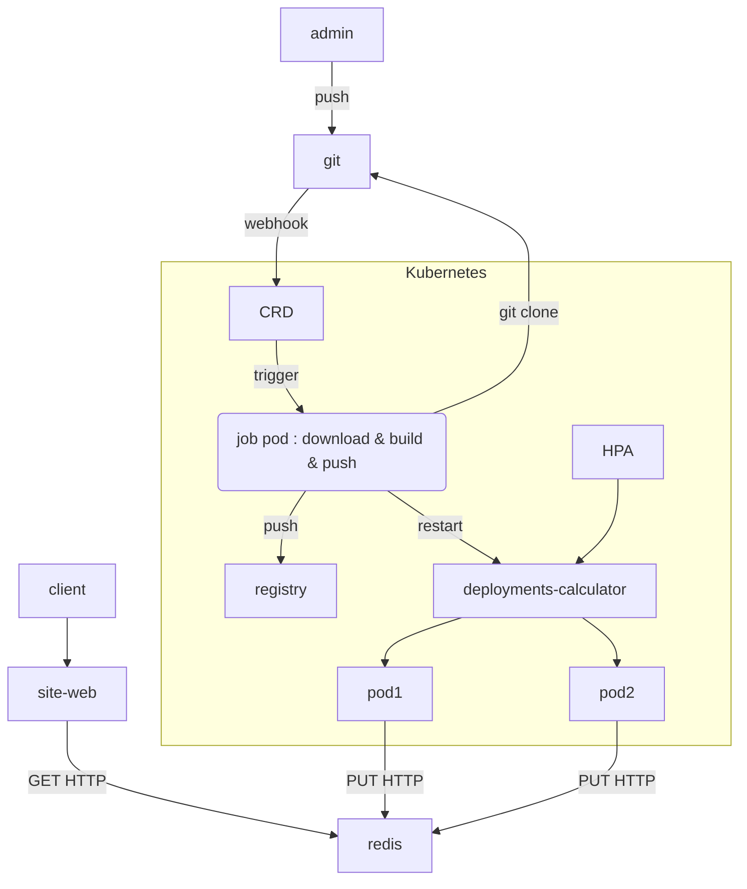
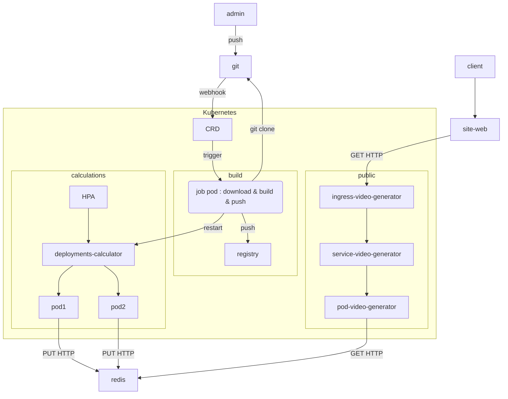
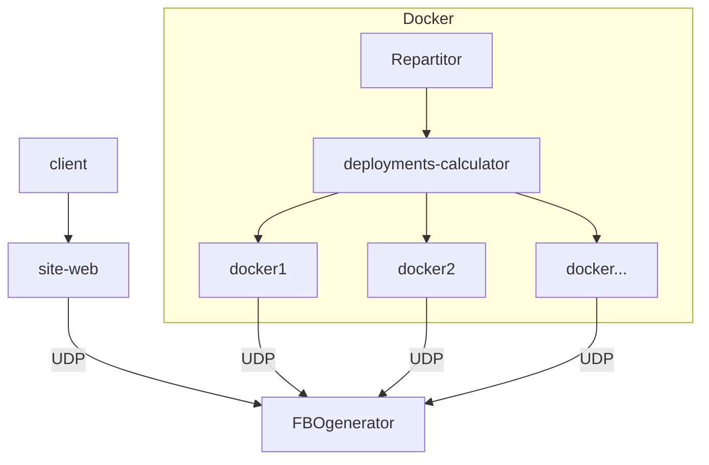

# nbody-simulator-cloud

<p align="center">
      
      
      
      
</p>

## Description

This is a simple nbody simulator made with OpenGL and C++ with the help of the ImGui library for the UI.

## Architecture
## v1


## v2



## v3



## v4



## Tasks

Fromiel:
- Docker compose

Quentin:
- Créé image pour paritucle

Alshor:
- ffmpeg

## Images

## Videos

## Features

## Dependencies

- OpenGL version: 4.6.0
- GLSL version: 4.60
- GLFW version: 3.3.8
- Glad version: 0.1.36
- ImGui version: 1.89.4 WIP
- GLM version: 0.9.8

## CMake project compilation

```bash
cmake -B . -DCMAKE_BUILD_TYPE=Release
```

then

```bash
cmake --build . --config Release
```

## Github-Actions

[](https://github.com/Im-Rises/NBodySimulator/actions/workflows/codeql.yml)
[](https://github.com/Im-Rises/NBodySimulator/actions/workflows/cmake.yml)
[](https://github.com/Im-Rises/NBodySimulator/actions/workflows/flawfinder.yml)
[](https://github.com/Im-Rises/NBodySimulator/actions/workflows/cpp-linter.yml)

The project is set with a set of different scripts:

- CodeQL: This script is used to check the code for security issues.
- CMake: This script is used to build the project.
- Flawfinder: This script is used to check the code for security issues.
- Cpp Linter: This script is used to check the code for security issues.

## Libraries

glfw:  
<https://www.glfw.org/docs/latest/>

glm:  
<https://glm.g-truc.net/0.9.9/index.html>

glad:  
<https://glad.dav1d.de/>

Dear ImGui:  
<https://github.com/ocornut/imgui>

OpenGL:  
<https://www.opengl.org/>

OpenCL:  
<https://www.khronos.org/blog/your-opencl-developer-experience-just-got-upgraded>  
<https://github.com/KhronosGroup/OpenCL-Guide>  
<https://github.com/KhronosGroup/OpenCL-SDK>

## Documentation

learnopengl (OpenGL tutorial):  
<https://learnopengl.com/In-Practice/2D-Game/Particles>

OpenCL NBody example:  
<https://github.com/KhronosGroup/OpenCL-SDK/tree/f510201a092363b66969888df49c68721ca2c4fb/samples/extensions/khr/nbody>

The coding challenge:  
<https://editor.p5js.org/codingtrain/sketches/joXNoi9WL>

## Contributors

Quentin MOREL:

- @Im-Rises
- <https://github.com/Im-Rises>

Axel COURMONT:

- @Alshkor
- <https://github.com/Alshkor>

Alexis ROVILLE:

- @Fromiel
- <https://github.com/Fromiel>

[](https://github.com/Im-Rises/NBodySimulator/graphs/contributors)
