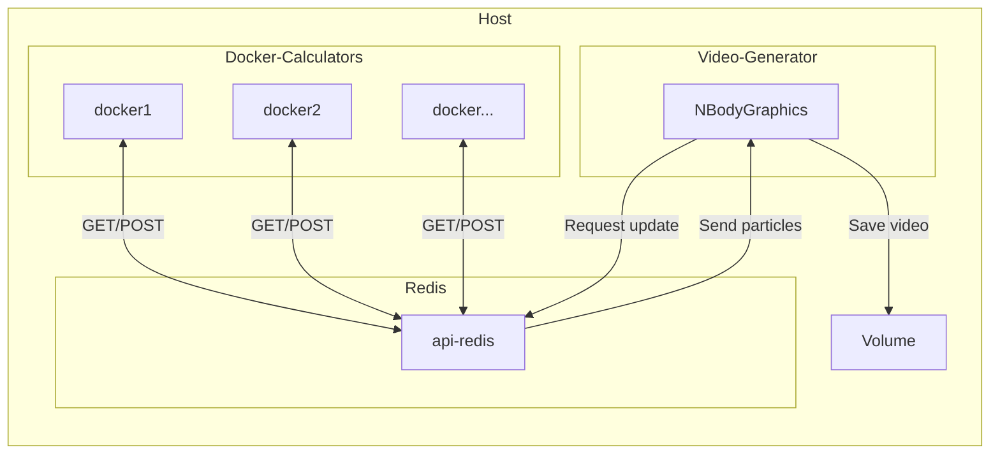
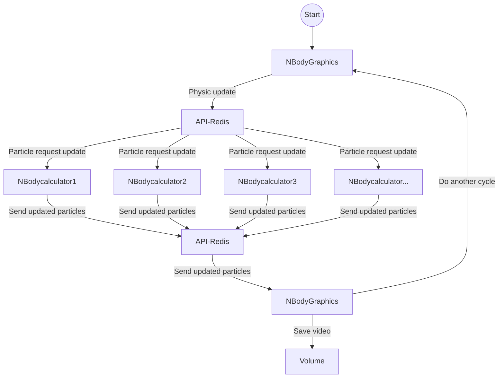

# nbody-simulator-docker

<p align="center">
        
        
        
        
        
</p>

[//]: # (         )

## Description

This is a simple n-body simulator made with OpenGL for the graphics part and C++ for the logic part.
The project is running on a complete docker environment.

> **Note**  
> The project is a test of paralleling the calculation of the particles on different docker containers and store them in
> a redis database.
> A docker is also used to generate the video from the redis database.

## Videos

[//]: # (https://github.com/Im-Rises/nbody-simulator-docker/assets/59691442/59ef1c71-e2bb-4bd5-99f8-66eace4280b5)

https://github.com/Im-Rises/nbody-simulator-docker/assets/59691442/622717a8-b508-4221-a79e-f00c07475979

Longer video 🚀🚀 [here](https://www.youtube.com/watch?v=OisxyKE_ioU) 🚀🚀

## How to use

To use the project, you need to have docker installed on your computer.
You can download it here: <https://www.docker.com/>

You also need to install the following linux lib:

```bash
sudo apt-get install xvfb
```

You also need python3 installed on your computer.
You can download it here: <https://www.python.org/downloads/>

Once you have installed the requirements, you can install the python libs with the following command:

```bash
pip install -r requirements.txt
```

This will install the required libs to generate the `docker-compose.yml` using the `docker-compose-generator.py` python
script.

```bash
python3 docker-compose-generator.py <total_particles> <number_of_calculators> <simulation_recording_time>
```

exemple:

```bash
python3 docker-compose-generator.py 1000 4 10
```

This will generate a `docker-compose.yml` file with 4 calculators and 1000 particles and a simulation recording time of
10 seconds.

Once created you can run the `docker-compose.yml` with the following command:

```bash
./test.sh
```

An output video will be genereated in the `./src/NBodyGraphics/output_dir` folder.

## Dependencies

- OpenGL version: 3.3
- GLSL version: 330
- GLFW version: 3.2.1
- Glad version: 0.1.36
- GLM version: 0.9.9
- OpenCV version: 4.7.0-dev
- nlhomann/json version: 3.9.1
- libcurl version: 7.74.0

## Architecture



## Logic Diagram



## Libraries

docker:  
<https://www.docker.com/>

cmake:  
<https://cmake.org/>

glfw:  
<https://www.glfw.org/docs/latest/>

glm:  
<https://glm.g-truc.net/0.9.9/index.html>

glad:  
<https://glad.dav1d.de/>

OpenGL:  
<https://www.opengl.org/>

Json:  
<https://github.com/nlohmann/json>

libcurl:  
<https://curl.se/libcurl/>

## Contributors

Axel COURMONT:

- @Alshkor
- <https://github.com/Alshkor>

Quentin MOREL:

- @Im-Rises
- <https://github.com/Im-Rises>

Alexis ROVILLE:

- @Fromiel
- <https://github.com/Fromiel>

[](https://github.com/Im-Rises/nbody-simulator-docker/graphs/contributors)
